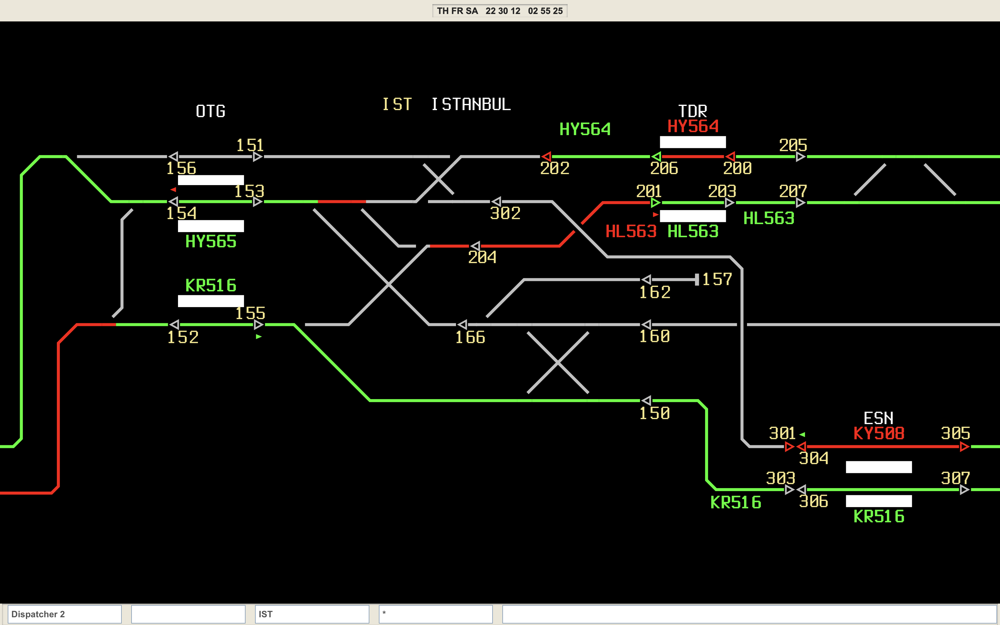

# TrackTitans
TrackTitans is a web-based simulation of the Indian Railway Section Controller system used for mainline operations on the Delhi-Agra section.

The Electronic Interlocking and Section Controller system used in Indian Railway mainline operations is being simulated.

Users can dispatch trains and open routes using the built-in commands following Indian Railway conventions.

For more info and help, visit the project's [website](https://tracktitans.com).

## Train Numbering System

The simulation uses proper Indian Railway 5-digit train numbers:
- **12xxx** - Express trains (Premium services)
- **13xxx** - Mail/Express trains 
- **15xxx** - Passenger trains
- **19xxx** - Freight trains

## Section Operations

The simulation covers operations on the Delhi-Agra section with proper Indian Railway:
- Station codes (NDLS, AGC, TDL etc.)
- Signaling systems
- Section Controller procedures
- Electronic Interlocking commands

## Technology Stack

- JavaScript for simulation logic
- HTML/CSS for interface
- Web-based deployment for accessibility
